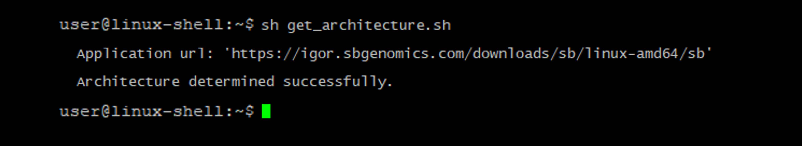

# NHLBI-DMC

[NHLBI BioData Catalyst](https://biodatacatalyst.nhlbi.nih.gov/) is a cloud-based ecosystem providing tools, applications, and workflows in secure workspaces (see Figure in Addendum 1). By increasing access to NHLBI datasets and innovative data analysis capabilities, BioData Catalyst accelerates efficient biomedical research that drives discovery and scientific advancement, leading to novel diagnostic tools, therapeutics, and prevention strategies for heart, lung, blood, and sleep disorders. BioData Catalyst supports the overall [Strategic Vision](https://www.nhlbi.nih.gov/about/strategic-vision) of NHLBI and, in particular, [Objective 7](https://www.nhlbi.nih.gov/about/strategic-vision/goals-and-objectives/leverage-emerging-opportunities-data-science-open-new).

Though the primary goal of the BioData Catalyst program is to build a data science ecosystem, at its core, this is a people-centric endeavor. BioData Catalyst is also building a community of practice working collaboratively to solve technical and scientific challenges. The community includes developers, computer scientists and bioinformaticians who are building and operating the cloud-based platform; the data generators who collect and generate the data from NHLBIfunded studies; and platform users who access and compute on the data within the platform. 

The NHLBI BioData Catalyst Data Management Core (DMC) supports the ingestion of multiple data sets of varied data types (electronic health record, research clinic surveys and assessments, genotypes, molecular and laboratory, imaging) into BioData Catalyst. This is a resource to aid in this task. 

## Table of contents
* [BioData Catalyst](#biodata-catalyst-powered-by-seven-bridges)
* [Command Line Interface](#command-line-interface)
* [Installer](#choose-cli-installer)
* [Usage](#usage)
* [Example](#example)
* [CLI Installation](#cli-installation)
* [Additional Resources](#additional-resources)
* [Authors](#authors)
* [Acknowledgments](#acknowledgments)

## BioData Catalyst Powered by Seven Bridges
[BioData Catalyst Powered by Seven Bridges](https://biodatacatalyst.nhlbi.nih.gov/platforms/seven-bridges) is a platform with collaborative workspaces for analyzing data at scale. This platform enables users to bring their own data for analysis and work in [RStudio](https://posit.co/download/rstudio-desktop/), [Jupyterlab Notebooks](https://jupyter.org/), and [SAS](https://www.sas.com/en_us/home.html) for interactive analysis.

## Command Line Interface
Seven Bridges has provided a command line interface (CLI) tool to programmatically access and automate your interaction with the BioData Catalyst platform. The CLI enables users to perform many platform operations including data upload, file tagging, and adding metadata.

Additional documentation can be found [here](https://sb-biodatacatalyst.readme.io/docs/command-line-interface)

## Choose CLI Installer
There are multiple installation files available to install the command line interface. You will first need to determine which installation file is appropriate for your environment. The script in this repository will help users to identify which installer is the most appropriate for their system. This script is a subset of the [code provided by Velsera](https://igor.sbgenomics.com/downloads/sb/install.sh) but does not require sudo priviledges to run. 

## Usage
After cloning this repository to your local compute, run the script by issuing the command 
```sh get_architecture.sh ```
The script will examine your system architecture and report the URL for the installer that is appropriate for your environment. 

## Example
<p align="left">
  
</p>

## CLI Installation
You can now download the recommended CLI using the wget command and the provided URL.

```
wget https://igor.sbgenomics.com/downloads/sb/linux-amd64/sb
chmod +x sb
```

## Additional Resources
* https://sb-biodatacatalyst.readme.io/

## Feedback
Yes! Please give us your feedback, raise issues, and let us know how the tool is working for you. Pull requests are welcome.

## Authors
Software developers: Adapted from the Velsera script by Jeran Stratford

## Acknowledgments
We'd like to thank Velsera and the BioData Catalyst Powered by Seven Bridges team, as well as the NHLBI Data Management Core. 
